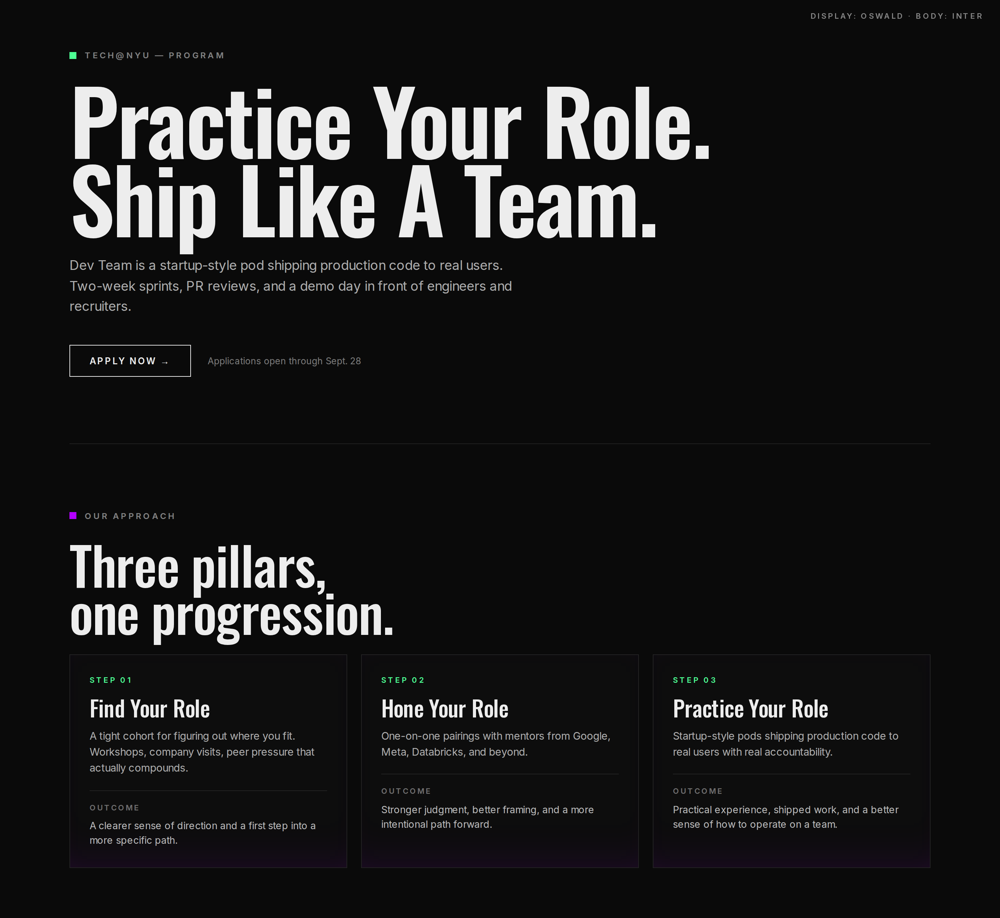
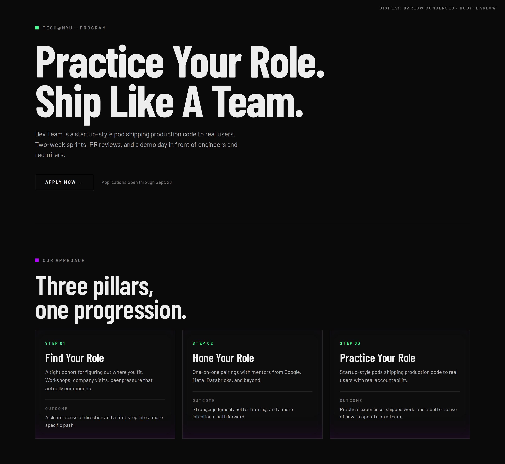

# Branding Reorientation — Design Consistency Decisions

> **Purpose.** This is a working decisions log to consolidate inconsistent visual choices across the marketing site so that `Design.md` becomes a true source of truth. It is intentionally a list of **to-decides**, not a finished spec. Each item lists where the inconsistency lives, what variants exist today, and proposed defaults — so they can be ticked through quickly in a review session and then encoded into `Design.md`.
>
> **Scope.** Visual decisions only — typography, color, layout, components, motion. **Not** copy, **not** information architecture (those are downstream).
>
> **Output goal.** A single agreed-upon system that lets the homepage, program pages, team page, and footer feel like one product. The companion follow-up is to refactor `landing_reorganize` against the agreed answers.

---

## How to use this doc

For each section below:
1. Read the **Observed today** column — every variant currently in code, with file paths.
2. Pick one option from **To decide**, or write a custom answer.
3. Once decided, the answer gets folded into `Design.md` and the cleanup PR enforces it.

---

## 1. Typography

### 1.1 Display / heading font (the "nice heading font" we want to keep, lightly tweaked)

**Observed today.** `Darker Grotesque` is the de-facto display font on program pages. It's loaded via `lib/fonts.ts` and reached through `font-[family-name:var(--font-darker-grotesque)]` (used in 100+ places). The homepage hero (`components/sections/hero.tsx:112`) does **not** use Darker Grotesque — it inherits Satoshi via `font-bold`. The `About` and `Values` headings (`components/sections/about.tsx:9`, `components/sections/values.tsx:35`) also use the default sans (Satoshi) at `text-2xl/4xl font-extrabold`.

The "nice heading on the program/view page that looks slightly off" is almost certainly Darker Grotesque used at extra-bold + tight tracking (`-0.05em`) + `leading-[0.83]` on `MentorshipAsciiHeroSection.tsx:84` and `TechTreksHeroSection.tsx:52`. The tracking and the R/F shapes feel idiosyncratic at that compression. The user's note ("similar but with a little bit more normal R and F") points at either:
- a less compressed weight (`font-medium` 500 vs `font-extrabold` 800 — 500 is what most program section H2s already use, e.g. `ProgramTracksSection.tsx:24`), or
- a different Grotesque cut entirely (Inter Display, GT America, Söhne Headline, Neue Haas Grotesk Display) where R/F geometry is more conventional.

**To decide.**

- [ ] **D1.1.** Keep `Darker Grotesque` as the display family across the whole site (homepage hero + program heroes + every H2/H3)?
  - [ ] yes, keep — but standardize on **`font-medium` (500)** as the default display weight, reserving `font-extrabold` (800) only for hero H1s.
  - [ ] yes, keep — but **drop tracking from `-0.05em` to `-0.025em`** on hero sizes to make R/F read more naturally.
  - [ ] swap to a different display face (candidates to A/B: Inter Display, GT America Mono / Cond, Neue Haas Grotesk Display, Söhne Breit). If swapping, the old Darker Grotesque should be removed from `lib/fonts.ts` and the `font-[family-name:var(--font-darker-grotesque)]` overrides replaced with a single Tailwind utility (`font-display`).
  - [ ] keep Darker Grotesque on program pages but use the new face only for the homepage hero + section headings (split system — **not recommended**, but capturing the option).
- [ ] **D1.2.** Should the homepage hero (`hero.tsx:110-114`) be re-skinned in the chosen display font? Today it uses Satoshi `font-bold` at `text-[5vw]` which reads softer than the program heroes.

#### Display-font shortlist (need-to-trial)

The brief: keep Darker Grotesque's "thin-but-long" silhouette (tall x-height, slightly narrow proportions, tight tracking at hero sizes) but with conventional R/F/a glyph design. Trial in this order — closest-to-Darker-Grotesque-proportion → most editorially compressed:

| # | Font | License | Why it's on the list |
| --- | --- | --- | --- |
| 1 | [Oswald](https://fonts.google.com/specimen/Oswald) | Free (Google) | Closest direct match to Darker Grotesque's silhouette. Tall x-height, medium-narrow, full weight range, conventional R/F. **Trial first.** |
| 2 | [Barlow Condensed](https://fonts.google.com/specimen/Barlow+Condensed) | Free (Google) | Slightly narrower than Oswald. Very normal letterforms. Ships every weight + italics, so it could double as a body face if we want to consolidate to one family. |
| 3 | [Big Shoulders Display](https://fonts.google.com/specimen/Big+Shoulders+Display) | Free (Google) | Variable font, taller and narrower than Oswald. Use if we want more "editorial poster" energy at hero sizes. |
| 4 | [Söhne Schmal](https://klim.co.nz/retail-fonts/sohne-schmal/) | Paid (Klim) | The polished/refined version of this lane. The Stripe-tier pick. |
| 5 | [Druk](https://commercialtype.com/catalog/druk) | Paid (Commercial Type) | Ultra editorial, goes harder than Darker Grotesque but glyphs are completely conventional. Reserve for one signature treatment, not the system. |

**Trial method.** Drop the font file into `/public/fonts/<Name>`, register it in `lib/fonts.ts` as a `localFont` next to `--font-darker-grotesque`, and swap the CSS variable on a single program-page hero (`ProgramHeroSection.tsx:36`) to compare in context. ~10 min per font for the four free options.

**Trial settings to test.** Hero H1 at weight 600–700, tracking ≈ −2%, leading 0.88. That isolates the silhouette comparison from weight/tracking variables.

#### Free combos rendered against site styling

Two combos rendered (live HTML in `docs/font-previews/`, screenshots below). Both use the site's actual surface (`#0A0A0A`), accent dot (`#4DFF94` / `#B300FF`), section spacing, and bento-card chrome — so the comparison is apples-to-apples and only the typography varies.

##### Combo A — Oswald (display) + Inter (body)



- Sharpest "editorial-technical" silhouette of the free options. Oswald's narrow, tall H1 reads as serious immediately.
- Inter is already loaded in `lib/fonts.ts:50` → swap risk is low. Eyebrows and CTAs use Inter at uppercase tracking, which matches the existing program-page treatment.
- Strongest contrast between display and body, which is what `Design.md` says display headings should be doing.

##### Combo B — Barlow Condensed (display) + Barlow (body) [mono-family]



- Same family across display and body. The condensed cut handles hero impact; the regular cut handles paragraph reading.
- More humanist warmth than Oswald — slightly less "systems-club" and slightly more "campus publication."
- Mono-family is generally **not** advised because the contrast between display and body collapses. **Barlow is the exception**: the Barlow + Barlow Condensed pairing is *designed* to work together, with matching design DNA but distinct widths.

##### Verdict / recommendation

- **Default pick: Combo A (Oswald + Inter).** It best satisfies `Design.md`'s "technical, structured, editorial" mandate, has the largest visible step from display→body, and ships with the lowest swap cost (Inter already loaded).
- **Choose Combo B only if** the brand wants to read warmer / more campus-publication and we want the explicit mono-family reduction. Then commit fully — drop Inter from the system, use Barlow regular for everything that's currently Inter or Satoshi-body.
- **Not recommended:** mixing — e.g. Barlow Condensed display + Inter body. That gets the worst of both (lose mono-family cohesion, lose Oswald's sharpness).

Open the HTML files locally to see at full size:
- `docs/font-previews/oswald-inter.html`
- `docs/font-previews/barlow-mono.html`

- [ ] **D1.2a.** After trialing, lock the chosen face. Remove Darker Grotesque from `lib/fonts.ts` and replace every `font-[family-name:var(--font-darker-grotesque)]` occurrence with the new `font-display` Tailwind utility.

#### Wordmark / logo typeface (identification needed)

`public/logo.svg` is the `tech@nyu` wordmark. The original typeface file is lost; the SVG is fully outlined paths (no `font-family` metadata). Path-trace observations:

- 8 glyphs at x-positions `1, 41, 92, 143, 196, 292, 337, 391` → maps to `t · e · c · h · @ · n · y · u`.
- Canvas height 79; lowercase x-height ≈ 40 units (≈ 51%) — tall but not extreme.
- Ascender extension ≈ 18 units; descender ≈ 16 units.
- Heavy weight (Bold / Black range), neutral grotesk geometry, no humanist quirks.
- Distinctive double-storey `@` with a solid outer ring and a closed inner double-storey `a` loop.

That proportional fingerprint fits the classic neo-grotesk family. Most probable candidates (in order of fit):

1. **Aktiv Grotesk Bold/Black** (Dalton Maag) — https://www.daltonmaag.com/library/aktiv-grotesk
2. **Helvetica Neue 75 Bold / 85 Heavy** — https://www.linotype.com/1266875/neue-helvetica-family.html
3. **Founders Grotesk Bold** (Klim) — https://klim.co.nz/retail-fonts/founders-grotesk/
4. **Söhne Halbfett / Kräftig** (Klim) — https://klim.co.nz/retail-fonts/sohne/
5. **Inter Bold/Black** (free) — https://rsms.me/inter/

**Confirm with a matcher.** Upload `public/logo.svg` (or a 2x PNG render) to:
- Fontspring Matcherator → https://www.fontspring.com/matcherator
- WhatTheFont → https://www.myfonts.com/pages/whatthefont

- [ ] **D1.2b.** Identify the wordmark typeface and decide:
  - [ ] re-acquire the original face and use it as-is in the wordmark
  - [ ] replace with a closest-match free face (Inter Black is the most likely free clone) and re-render the wordmark cleanly at multiple sizes
  - [ ] keep the SVG as outlined paths (no font dependency) but document the identified family in `Design.md` for future logo lockups

### 1.2 Body / supporting font

**Observed today.** Mixed.
- Body default = Satoshi (set globally on `<body>` in `app/globals.css:81`).
- Program-page eyebrows, paragraphs, CTAs, role descriptions, FAQ answers all force `font-[family-name:var(--font-inter)]` (`ProgramHeroSection.tsx:31,46`, `ProgramAboutSection.tsx:24,61`, `ProgramFAQSection.tsx:28`, `ProgramFinalSection.tsx:28,40`, ~80 occurrences).
- The footer uses Satoshi explicitly (`footer.tsx:44,64`).
- FAQ answer copy specifically forces Satoshi inside an Inter-leaning section (`ProgramFAQSection.tsx:71`) — visible mismatch.

**To decide.**

- [ ] **D1.3.** One body family or two?
  - [ ] **Satoshi everywhere** — remove every `font-[family-name:var(--font-inter)]` override (~80). Inter would still load via Tailwind preflight but be unused.
  - [ ] **Inter everywhere** — flip globals.css to Inter and delete the Satoshi local font.
  - [ ] **Satoshi for body + Inter for "system" labels** (eyebrows, status pills, monospace-feel uppercase). This is roughly today's intent but executed inconsistently — formalize and enforce.
- [ ] **D1.4.** Pick a single family for **eyebrow / kicker text** (`UPPERCASE`, `tracking-[0.15em]`, `text-[13px] opacity-55`). Today: Inter on program pages, Satoshi everywhere else (e.g. spotlight `text-xs uppercase tracking-[0.35em]`, footer `tracking-[0.28em]`). Pick one font + one tracking value (see §1.5).

### 1.3 Heading scale (one ladder, applied consistently)

**Observed today.** No shared scale. Every section invents its own clamp:

| Section | H1/H2 size | Source |
| --- | --- | --- |
| Hero (home) | `text-[12vw]→[5vw] font-bold` | `hero.tsx:112` |
| Spotlight featured | `clamp(4.6rem, 4.5vw, 5.3rem)` | `spotlight.tsx:75` |
| About (home) | `text-base default` (no explicit size) | `about.tsx:9` |
| Values (home) | `text-2xl lg:text-4xl font-extrabold` | `values.tsx:35` |
| History eyebrow | `text-[0.82–0.92rem] tracking-[0.3em]` | `history.tsx:166` |
| Programs v2 hero | `clamp(3.5rem, 7vw, 7.75rem)` | `program_section_v2.tsx:77` |
| Program page hero | `clamp(72px, 11vw, 130px)` | `ProgramHeroSection.tsx:37` |
| Tech Treks / Mentorship hero | `clamp(56px, 8.5vw, 116–118px)` | `TechTreksHeroSection.tsx:53`, `MentorshipAsciiHeroSection.tsx:86` |
| ProgramAbout H2 | `clamp(40px, 6vw, 68px)` | `ProgramAboutSection.tsx:29` |
| ProgramTracks H2 | `clamp(40px, 6vw, 68px)` | `ProgramTracksSection.tsx:25` |
| ProgramRoles H2 | `clamp(40px, 6vw, 68px)` | `ProgramRolesSection.tsx:16` |
| ProgramCompanyGrid H2 | `clamp(40px, 6vw, 68px)` | `ProgramCompanyGridSection.tsx:36` |
| ProgramFAQ H2 | `clamp(36px, 5vw, 60px)` | `ProgramFAQSection.tsx:33` |
| ProgramPillars H2 | `clamp(36px, 5vw, 62px)` | `ProgramPillarsSection.tsx:24` |
| ProgramFinal H2 | `clamp(52px, 8vw, 100px)` | `ProgramFinalSection.tsx:34` |
| StandardBuildTabs / DevTeamPortfolio H2 | `clamp(40px, 7.5vw, 120px)` | `StandardBuildTabsSection.tsx:48`, `DevTeamStartupPortfolioSection.tsx:52` |
| Card title (3-pillar) | `clamp(26px, 2.4vw, 34px)` vs `clamp(28px, 3.2vw, 44px)` | `ProgramPillarsSection.tsx:39` vs `ProgramAboutSection.tsx:57` |
| Bento card title | `clamp(2.6rem, 3vw, 3.9rem)` | `program-track-bento.tsx:115` |
| Spotlight secondary | `text-[1.9rem] md:text-[2.05rem]` | `spotlight.tsx:130` |

**To decide.**

- [ ] **D1.5.** Adopt a single heading ladder (suggested 5 steps). Proposed numbers below — to be ratified.
  - `display-1` (page hero H1): `clamp(64px, 10vw, 128px)` — `font-extrabold`, `tracking-[-0.04em]`, `leading-[0.88]`
  - `display-2` (section H2 / "in-page hero"): `clamp(48px, 7vw, 96px)` — `font-extrabold`, `tracking-[-0.035em]`, `leading-[0.9]`
  - `display-3` (standard section H2): `clamp(36px, 5vw, 64px)` — `font-medium`, `tracking-[-0.02em]`, `leading-[0.92]`
  - `heading-1` (card / inline H3): `clamp(24px, 2.6vw, 36px)` — `font-medium`, `tracking-[-0.015em]`, `leading-[1.05]`
  - `heading-2` (sub-card H4): `clamp(18px, 1.6vw, 22px)` — `font-medium`, `tracking-[-0.005em]`, `leading-[1.15]`
  - encode as Tailwind utilities (`text-display-1` etc.) and forbid raw `text-[Xvw]` in new code.
- [ ] **D1.6.** Standardize **eyebrow** → one token: `text-[12px] font-semibold uppercase tracking-[0.22em] text-white/55`. Today's tracking varies: `0.12em / 0.14em / 0.15em / 0.16em / 0.18em / 0.22em / 0.24em / 0.28em / 0.3em / 0.32em / 0.35em` (every section invents its own).
- [ ] **D1.7.** Standardize **body copy** → `text-[15px] md:text-[17px] leading-[1.55] text-white/72`. Today: `text-[13px]/[14px]/[15px]/[16px]/[17px]/[18px]/[19px]` mixed; opacities are `/55, /58, /62, /66, /68, /70, /72, /74, /82` — eight different "muted" tones.
- [ ] **D1.8.** Italics policy. Italic display (Darker Grotesque italic) is used once — pull-quote in `ProgramAlumniSection.tsx:226`. Either keep as the dedicated quote treatment or remove italic display from the system entirely.

### 1.4 Tracking conventions

**Observed today.** Eyebrows: 11 different tracking values (see D1.6). Hero display: `-2px` literal in `ProgramHeroSection.tsx:37`, `-0.05em` in Tech Treks/Mentorship hero, `-0.04em` in v2 programs hero, `-0.045em` in spotlight featured. **To decide → D1.5/D1.6 adoption fixes this.**

### 1.5 White-text opacity tokens

**Observed today.** The site has at least these "muted white" tones in active use: `white/12, /15, /18, /20, /28, /34, /35, /38, /40, /42, /45, /48, /50, /55, /58, /60, /62, /65, /68, /70, /72, /74, /78, /82` (24 distinct values). Borders: `white/8, /10, /12, /14, /16, /18, /20, /22, /25, /28, /30`.

**To decide.**

- [ ] **D1.9.** Reduce to 3 tiers and write into a Tailwind theme:
  - `text-fg` = `#EDEDED` (full)
  - `text-fg-muted` = `white/72`
  - `text-fg-faint` = `white/48`
  - `text-fg-ghost` = `white/28` (disabled / footnote)
  - `border-line` = `white/10`
  - `border-line-strong` = `white/22`
- [ ] **D1.10.** Pick `#EDEDED` vs pure `#FFFFFF` as the canonical foreground. Currently both ship.

---

## 2. Color & accent system

### 2.1 Brand accents

**Observed today.** `Design.md` declares purple + green as the dominant accents. The codebase actually ships **seven** accents:

| Color | Hex | Where |
| --- | --- | --- |
| Brand purple | `#B300FF` / `rgba(179,0,255,*)` | program-stage-map (Tech Treks), Roles, Final, glow shadows, home-cta radial, programs_v2 radial |
| Brand green | `#4DFF94` / `rgba(77,255,148,*)` | hero pill on ProgramHeroSection, Pillars step label, Roles, status pills, Tracks, Buildathon, home-cta radial, value-card "green" |
| Spotlight blue | `#4D8DFF` | spotlight eyebrow dot (`spotlight.tsx:114`) |
| Stage purple-blue | `#7B5CFF` | Mentorship stage accent (`program-stage-map.ts:62`) |
| Stage blue | `#4AA8FF` | Dev Team stage accent (`program-stage-map.ts:81`) |
| Mentorship orange | `#FF6836` / `rgba(255,104,54,*)` and `#FFB194` / `#FFD3C3` | MentorshipAsciiHero, MentorshipImmersiveIntro, FAQ accent default |
| Build-tab orange | `#FF9F43` and pale `#FFF1DD` | StandardBuildTabsSection badge "public" |
| Build-tab "fund" blue | `#8FC6FF`, `#10264F`, `#F5FBFF` | DevTeamStartupPortfolioSection badge "fund" |
| Role-card legacy | Tailwind `red/green/blue/purple/orange-500` | `role-card.tsx:27-48` (unused outside legacy paths) |

`Design.md` says: "These [purple + green] are brand signals and should remain the dominant accent language." The current site clearly violates that.

**To decide.**

- [ ] **D2.1.** Lock the brand to **purple + green only** (Design.md baseline)?
  - [ ] yes — purple `#B300FF`, green `#4DFF94`. Demote everything else to neutral white/gray.
  - [ ] yes, but allow **one tertiary signal** (blue or orange) and pick which. Currently the system has multiple tertiaries with no rule.
  - [ ] no — formalize a 4-color stage system (purple → indigo → blue → green) tied to the program ladder (Tech Treks → Mentorship → Dev Team → Startup Week). This is what `program-stage-map.ts` already encodes; if we adopt it, every other accent (orange, blue spotlight, build-tab oranges) must be removed.
- [ ] **D2.2.** Mentorship orange (`#FF6836`/`#FFB194`) — keep as a Mentorship-only signature, or kill in favor of purple? Today it bleeds into FAQ default (`ProgramFAQSection.tsx:19`) and is used on Tech Treks pages indirectly, which dilutes the "Mentorship = orange" intent.
- [ ] **D2.3.** Define the canonical accent token shape:
  ```
  --accent-primary: #B300FF;
  --accent-primary-soft: rgba(179,0,255,0.16);
  --accent-secondary: #4DFF94;
  --accent-secondary-soft: rgba(77,255,148,0.16);
  ```
  and forbid raw rgba accent values in components.
- [ ] **D2.4.** Status pill colors — open (green), closed (red `#?`). Today closed uses `bg-red-500` (`role-card.tsx:30`) and `bg-red-500` again (`ProgramRolesSection.tsx:86`). Open uses `bg-[#4DFF94]` with various glow strengths. Pick one open hex + one closed hex, lock glow.

### 2.2 Background surfaces

**Observed today.** Six near-blacks: `#000`, `#020202`, `#030303`, `#040404`, `#050505`, `#070707`, `#090909`, `#0a0a0a`, `#0b0b0b`, `#0d0d0d`. Plus `bg-black/30/40/45/55`.

**To decide.**

- [ ] **D2.5.** Compress to 3 surface tokens:
  - `--surface-base` = `#0A0A0A` (page background, matches `globals.css`)
  - `--surface-raised` = `#0D0D0D` (cards, hero overlays)
  - `--surface-deep` = `#050505` (footer, deep wells, image plates)
  - everything else gets purged.

### 2.3 Gradients & radial glows

**Observed today.** Every section invents its own radial recipe.
- `home-cta.tsx:11` — top-right green + bottom-left purple radial (purple+green pair).
- `program_section_v2.tsx:67` — 4-stop radial (purple, green, blue, indigo).
- `program-track-bento.tsx:228, 253` — separate gradients per row, mixing 3 hues each.
- `MentorshipAsciiHeroSection.tsx:57` — orange radial pair.
- `MentorshipImmersiveIntro.tsx:71` — purple + orange + black ladder.
- `ProgramHeroSection.tsx:71` — single 7%-purple radial (very subtle).
- `spotlight.tsx:73, 90` — linear black-on-black gradients on featured slot.

**To decide.**

- [ ] **D2.6.** Define a small library of named gradient presets (e.g. `gradient-hero-purple`, `gradient-cta-pair`, `gradient-stage-{purple|green|blue|indigo}`) and require components to pull from it. Block ad-hoc inline `radial-gradient(...)` strings in section files.
- [ ] **D2.7.** Decide on a **single** "section vignette" (the layered linear gradient that lives at the bottom of full-bleed hero sections — Tech Treks, Mentorship, Footer all roll their own at slightly different stops). Pick one curve.

### 2.4 Glows / inset shadows on cards

**Observed today.** Two flavors of "inset glow":
- Legacy `inset 0 0 100–200px rgba(179,0,255,0.4)` — `role-card.tsx:59`, `values/style.css`, `ProgramRolesSection.tsx:60`, `ProgramAboutSection.tsx:38` (uses card-level `glow` field).
- Modern `inset 0 -56px 80px -72px <accentSoft>, inset 0 0 84px -76px <accent>` — `program-track-bento.tsx:92, 172`. Much more restrained, more in line with `Design.md` "restrained glow."

**To decide.**

- [ ] **D2.8.** Kill the heavy inset (`100-200px @ 0.4` opacity) everywhere and migrate every card to the bento-style restrained inset. Helper utility `card-glow` could ship with the cleanup.

---

## 3. Layout / spacing / containers

### 3.1 Section padding

**Observed today.** Eight horizontal patterns: `px-5 / px-10 / px-[5vw] / px-[6vw] / px-[7vw] / px-[8vw]` (and combinations with `lg:`). Vertical: `py-16, py-18, py-20, py-24, py-[8svh], py-[10svh], py-[12svh], py-[14svh]`.

**To decide.**

- [ ] **D3.1.** Adopt one section shell utility, e.g. `section-shell` = `px-5 py-16 md:px-10 md:py-20 lg:px-[5vw] lg:py-[12svh]`. Remove `[8vw]` entirely (used only on program pages — that extra inset is what makes program pages feel narrower than home).
- [ ] **D3.2.** Decide whether section content lives inside a `max-w-[1600px] mx-auto` rail (homepage convention) or inside the section padding directly (program-page convention). Pick one. **Recommended:** unify on the rail.

### 3.2 Max-width values

**Observed today.** `max-w-[480px], 520px, 700px, 860px, 1240px, 1440px, 1600px, 56rem, 58rem, 68rem, 72rem, 7xl (1280px)`. No standard.

**To decide.**

- [ ] **D3.3.** Reduce to: `prose` (640px), `narrow` (820px), `wide` (1240px), `bleed` (1600px). Map every existing literal.

### 3.3 Border-radius

**Observed today.** `rounded-none / sm / md / lg / xl / 2xl / 3xl / full / [4px] / [10px] / [18px] / [20px] / [28px] / [2rem]`. `Design.md` says: section shells 20–32px, cards 16–24px, buttons square except for strong CTA pill.

**To decide.**

- [ ] **D3.4.** Lock the radius scale and **drop most rounding** to honor "blocky over squircle":
  - cards / panels: `rounded-none` (today's ProgramAbout/Pillars/Roles already do this — keep)
  - status pill / dot: `rounded-full` (keep)
  - section "shells" with full background (only when separating, e.g. `home-cta`): `rounded-[20px]`
  - buttons: `rounded-none` by default; `rounded-md` only for shadcn library buttons we keep around for forms.
- [ ] **D3.5.** Specifically replace `home-cta.tsx`'s `rounded-[2rem]` (32px, soft) with `rounded-[20px]` to match the rest, OR remove the rounded shell entirely and let the CTA bleed edge-to-edge like the spotlight section.
- [ ] **D3.6.** Remove `rounded-2xl/3xl` (12 + 1 instances) — these are out of brand per `Design.md` ("avoid excessive all-over rounded treatments").

### 3.4 Borders & dividers

**Observed today.** `border-white/8` (program section dividers), `border-white/10` (footer, home-cta, panel separators), `border-white/12, /14, /16, /18, /20, /22, /25, /28`. The `border-[#EDEDED]/8` is functionally identical to `white/8` but written differently — visually no difference but introduces inconsistency in tooling.

**To decide.**

- [ ] **D3.7.** Lock to **two** divider opacities: `border-white/10` (default) and `border-white/22` (active/focus/strong). Replace every other value via codemod.
- [ ] **D3.8.** Standardize section dividers — every program section uses `border-t border-[#EDEDED]/8`. Homepage sections use no top border (they rely on visual separation through padding). Pick one rule for the whole site.

### 3.5 The grid background (`Values` section)

**Observed today.** `components/sections/values.tsx:9-32` ships an SVG line grid (18 vertical × 25 horizontal, alternating opacity 0.6/0.3) — a brutally heavy effect that doesn't appear anywhere else on the site. `MentorshipImmersiveIntro.tsx:73` applies a much softer 34px grid via background-image at 8% opacity.

**To decide.**

- [ ] **D3.9.** Pick a single grid background recipe and use it sparingly:
  - drop the heavy SVG grid in `Values` (it fights the cards),
  - adopt the 34px CSS grid at `opacity-[0.08]` as the only "systems-layer grid."
- [ ] **D3.10.** Decide where the grid is allowed: hero overlays only, or also ambient under section walls?

---

## 4. Components — same job, different implementation

### 4.1 "3 pillars" pattern

**Observed today.** Three competing implementations of the same idea (3 cards in a row introducing values / approach / pillars):

1. **Homepage `Values`** (`components/sections/values.tsx`) — sticky-scroll parallax, 3 stacked full-bleed cards with heavy inner glow (`rgba(179,0,255,0.4)` and `rgba(77,255,148,0.4)`), outline `2px solid rgb(236,236,236)` (white outline). Custom CSS file. Uses Satoshi `text-2xl lg:text-4xl` heading.
2. **Program page `ProgramAboutSection`** (3-card grid) — `border-[#EDEDED]` cards with the **same** heavy `inset 150px` glow, Darker Grotesque H3 at `clamp(28px, 3.2vw, 44px)`. Used as "Our Approach."
3. **Program page `ProgramPillarsSection`** (3-card grid) — `border-[#EDEDED]/20` cards, **no** inset glow, green eyebrow `Step 01/02/03`, "Outcome" footer with white/12 divider, Darker Grotesque H3 at `clamp(26px, 2.4vw, 34px)`. Used as the structured "pillars."
4. **Programs v2 bento** (`program-track-bento.tsx`) — restrained inset glow, white/12 borders, stage-typed accents per card.

So: 4 visual treatments for what is essentially the same "show me three things" job. Card title sizes range from `clamp(26-44px)`, glows range from "0" to "200px @ 0.4 alpha", borders range from `white/12` to `white/100`.

**To decide.**

- [ ] **D4.1.** Consolidate into **one** "tri-card" component (`<TriadCards>`) that supports two variants:
  - `variant="approach"` — shows imagery + body, used where we want to explain
  - `variant="pillar"` — shows step number + body + outcome row, used for ladder/process
  - both share: `border-white/10`, `bg-surface-raised`, restrained inset glow only, Darker Grotesque H3 at the agreed `heading-1` size.
- [ ] **D4.2.** Sunset the homepage `Values` sticky-scroll. Replace with `<TriadCards variant="pillar">` so home and program pages tell the value story the same way. (Current sticky-scroll is also the section that's most "soft / consumer" — directly off-brand per `Design.md`.)
- [ ] **D4.3.** Decide whether step counters (`Step 01/02/03`) are required for the pillar variant or optional.

### 4.2 Bento sections

**Observed today.** Three different bento-ish layouts:
1. `program-track-bento.tsx` — 3 + 2 grid, stage-accented, restrained, current best example.
2. `DevTeamStartupPortfolioSection.tsx` — 2-column tab list + sticky panel + ASCII art preview, badge tones (`public/fund/redacted/neutral`), inset green focus ring.
3. `StandardBuildTabsSection.tsx` — same 2-column tab pattern but with image preview + dashed-border active state and weaker inset.

**To decide.**

- [ ] **D4.4.** Merge `StandardBuildTabsSection` into `DevTeamStartupPortfolioSection` (or vice versa) — they implement the same "2-col tabs + preview" pattern with cosmetic differences. Pick one canonical "BuildTabs" component.
- [ ] **D4.5.** Document the bento-card token (`border-white/12 + restrained inset accent`) as the official card chrome.

### 4.3 Role cards

**Observed today.**
- `components/ui/role-card.tsx` — legacy: `outline-2`, `inset 0 0 100px rgba(179,0,255,0.4)` glow regardless of `color` prop, Tailwind color names (`red-500/green-700/blue-500/purple-500/orange-500`), accent dots with shadow halos, `rounded-md` button. Heavy and inconsistent with rest of site.
- `ProgramRolesSection.tsx:65` — modern: `border-[#EDEDED] bg-black`, alternating purple/green inset glow keyed by index parity (i.e. odd cards green, even purple — purely cosmetic, not semantic), small `w-12 h-0.5` underline, text-only "Apps Open" status row, square button.

These two render the same data (RolesSection) and ship side by side. The legacy `role-card.tsx` appears unused in the active showcase flow but is still imported elsewhere — it should be confirmed dead and removed.

**To decide.**

- [ ] **D4.6.** Delete `components/ui/role-card.tsx` if confirmed dead. Otherwise rewrite it to match `ProgramRolesSection`'s in-line treatment.
- [ ] **D4.7.** Stop alternating purple/green by index. Either (a) tie the accent to the role's program (Tech Treks = purple, Dev Team = blue, Startup Week = green, Mentorship = orange/indigo), or (b) drop the accent entirely on role cards and rely on white-on-black with one accent only on the status dot.

### 4.4 Status pills ("Apps open / closed", "STEP 01", etc.)

**Observed today.** 5+ variants:
- `program-track-bento.tsx:128` — `border-white/10 bg-white/[0.03] px-2.5 py-1 text-[10px] uppercase tracking-[0.2em]` (square, restrained — recommended).
- `MentorshipImmersiveIntro.tsx:80` — `rounded-[10px] border bg-[rgba(255,104,54,0.12)]`.
- `StandardBuildTabsSection.tsx:72` — `rounded-full border` per tone.
- `DevTeamStartupPortfolioSection.tsx:117` — `rounded-none border` per tone.
- `ProgramRolesSection.tsx:84-91` — text + dot, no pill.
- `ApplicationStatus.tsx` (separate component) — its own thing.

**To decide.**

- [ ] **D4.8.** One pill: square (`rounded-none`), `text-[10px] font-semibold uppercase tracking-[0.2em]`, `px-2.5 py-1`, `border-white/10`, optional accent fill at 0.08–0.12 opacity. Use it for every status / tag / "Step 01" badge.
- [ ] **D4.9.** Replace `MentorshipImmersiveIntro`'s `rounded-[10px]` orange pill with the standard one. (Today it's the **only** rounded pill on the site.)

### 4.5 Buttons / CTAs

**Observed today.**
- Hero "View Programs" — square, `border border-white/30 px-8 py-4`, hover invert (`hero.tsx:138`). ✅ matches Design.md bias.
- Home CTA Discord/Events — square, white-fill primary + ghost secondary (`home-cta.tsx:30, 39`). ✅
- Program hero `Apply Now` — square, uppercase, `tracking-widest`, `transition-all duration-500` (`ProgramHeroSection.tsx:53`). ✅ but **slow 500ms transition** vs the 200ms used elsewhere — feels sluggish.
- Tech Treks/Mentorship hero CTA — same as program hero (also 500ms).
- Program Final CTA — same as program hero (500ms).
- Bento "Learn more" — Framer Motion 180ms invert (`program-track-bento.tsx:131`). ✅ snappy.
- Role card button (legacy) — `rounded-md`, 600ms transition. ❌ rounded + slow.
- Shadcn button — `rounded-md` default, fully out-of-system except where used by Radix internals.

**To decide.**

- [ ] **D4.10.** One CTA spec: `border border-white px-7 py-3 text-[13px] font-semibold uppercase tracking-[0.16em]`, hover invert, transition `200ms cubic-bezier(0.23, 1, 0.32, 1)`. Forbid 400/500/600ms transitions on CTAs.
- [ ] **D4.11.** Decide if there should be **two** CTA tones (primary white-fill, secondary ghost) or just ghost — today both exist but inconsistently.
- [ ] **D4.12.** Decide whether to keep the trailing `→` arrow glyph on every CTA. Today: most program CTAs include it as text (`{ctaLabel} →`), homepage hero uses lucide `<ArrowRightIcon>` icon, others omit. Pick one.

### 4.6 Eyebrow + dot signal

**Observed today.** "Section eyebrow with a small color square next to it."
- `ProgramHeroSection.tsx:31` — `inline-block w-2 h-2 bg-[#4DFF94]` square (green) + Inter eyebrow.
- `ProgramFinalSection.tsx:29` — same shape, but `bg-[#B300FF]` (purple).
- `ProgramAlumniSection.tsx:157` — `w-3 h-3 bg-[#B300FF]` (slightly bigger).
- `Spotlight.tsx:114` — `h-3 w-3 bg-[#4D8DFF]` (blue, the only place blue shows up).
- `home-cta.tsx:14` — no dot, just eyebrow.
- `History`, `About` — no dot.
- `program_section_v2.tsx:74` — no dot.

**To decide.**

- [ ] **D4.13.** Adopt the dot-eyebrow as the canonical section opener? If yes, lock to `w-2.5 h-2.5` square + accent picked from the section's stage. If no, drop it everywhere.

### 4.7 Footer signal field

**Observed today.** `FooterSignalField.tsx` is a unique full-bleed graphic with its own animation token (`footer-signal-animate` keyframe in `globals.css:97`). Beautiful but it's the only component of its kind — should we treat the system aesthetic shown here as a reference for **other** systems flourishes (e.g. status indicators, hero overlays)?

**To decide.**

- [ ] **D4.14.** Promote the footer signal field's "systems-layer" vocabulary (signal dots, faint grid, slow opacity pulse) into a small library used by hero corners and section dividers — or keep it footer-only.

### 4.8 Spotlight section

**Observed today.** `spotlight.tsx` ships its own type ladder (`text-[1.9rem]/[2.05rem]/[3.6rem]/[4.5rem]/clamp(4.6,4.5vw,5.3rem)`) with `font-bold` Darker Grotesque, blue dot eyebrow, and uses the `Separator` component for vertical rules — none of which appears elsewhere.

**To decide.**

- [ ] **D4.15.** Re-skin spotlight to share the same display ladder as program heroes (D1.5). Drop the unique blue dot or formalize blue as a real accent.
- [ ] **D4.16.** Keep `Separator`-based vertical rules, or replace with `border-r border-white/10` like the rest of the site.

### 4.9 The `About` (home) and `Values` (home) sections

**Observed today.**
- `about.tsx` uses `<TwoColumnSection>` rendered four times. Heading is just `<h1>` with a Lucide `<Square />` icon, no font override, no eyebrow, default text size (so it inherits Satoshi `text-base` ≈ 16px). The image column has `bg-amber-200` (yellow!) as a placeholder that ships in production (`TwoColumnSection.tsx:85`).
- `values.tsx` SVG grid + sticky-scroll cards (see §3.5/§4.1).
- Together these are the two homepage sections most out of sync with the program-page treatment.

**To decide.**

- [ ] **D4.17.** Rebuild `About` to use the same `<TriadCards>` / standard section header treatment as program pages. Remove the `bg-amber-200` placeholder.
- [ ] **D4.18.** Rebuild or remove `Values` (see D4.2).

### 4.10 Team page

**Observed today.** `team_grid.tsx` + `profile_card.tsx`. Cards have green inset shadow on hover, no shared border-radius rule, no shared eyebrow with the rest of the site. Filter chips use a different button shape than every other CTA.

**To decide.**

- [ ] **D4.19.** Align team profile card chrome to the bento card token (D4.5).
- [ ] **D4.20.** Align team filter chips to the standard square pill token (D4.8).

---

## 5. Motion

**Observed today.** Mixed: GSAP custom-ease (`hero.tsx`), `motionTokens` (`lib/motion.ts` — tokenized, used in alumni carousel only), Framer Motion `[0.23, 1, 0.32, 1]` literals (button hover invert), Tailwind `transition-all duration-500` (program CTAs), `duration-300` (Build tabs), `duration-200` (homepage hero CTA), `duration-600ms` arbitrary (legacy role-card button).

**To decide.**

- [ ] **D5.1.** Adopt `lib/motion.ts` tokens everywhere and ban raw `duration-N`/`ease-[...]` in components. Standard durations: hover-in 200ms, hover-out 160ms, enter 560ms, exit 460ms.
- [ ] **D5.2.** Drop `transition-all duration-500` on program CTAs in favor of the snappier 200ms hover-invert (matches `Design.md` "UI interactions should still feel immediate").
- [ ] **D5.3.** Decide whether the homepage hero's GSAP word-by-word reveal stays (it's the only place using SplitText) or whether we move to the same motion token system.

---

## 6. Imagery / placeholder treatment

**Observed today.**
- Wireframe SVGs (`CircuitWireframe`, `RocketWireframe`, etc.) are used as fallbacks for missing program images.
- Game-of-Life ASCII (`GameOfLifeAscii.tsx`) on Tech Treks hero.
- ASCII video (`MentorshipAsciiHeroSection.tsx` via `video2ascii`).
- Plain `` (no Next/Image) in `TwoColumnSection.tsx:87` — every other place uses `<Image>`.
- Yellow placeholder background `bg-amber-200` shipping in production.

**To decide.**

- [ ] **D6.1.** Pick one fallback aesthetic when a section has no real image — wireframe SVG, ASCII grid, or solid `surface-raised` with eyebrow only. Today all three coexist.
- [ ] **D6.2.** Convert `TwoColumnSection` to Next/Image and remove `bg-amber-200`.
- [ ] **D6.3.** ASCII heroes (Tech Treks GoL, Mentorship video2ascii) — keep both, or pick one as the "ASCII hero" treatment so program pages feel like one family?

---

## 7. Summary — the morning ticklist

Run through these in order. Each gets a yes / no / written answer and lands in `Design.md`:

| # | Question |
| --- | --- |
| D1.1 | Keep Darker Grotesque as display? Default weight = medium, hero only = extrabold? |
| D1.2 | Re-skin homepage hero in chosen display font? |
| D1.3 | Body family — Satoshi everywhere / Inter everywhere / Satoshi + Inter for system labels? |
| D1.4 | Eyebrow font + tracking value — pick one. |
| D1.5 | Adopt the 5-step heading ladder (display-1 / display-2 / display-3 / heading-1 / heading-2)? |
| D1.6 | Eyebrow token: `text-[12px] font-semibold uppercase tracking-[0.22em] text-white/55`? |
| D1.7 | Body token: `text-[15px] md:text-[17px] leading-[1.55] text-white/72`? |
| D1.8 | Italic display — keep for pull quotes only or remove? |
| D1.9 | Reduce text/border opacity tiers to fg / fg-muted / fg-faint / fg-ghost / line / line-strong? |
| D1.10 | Foreground = `#EDEDED` or pure `#FFFFFF`? |
| D2.1 | Lock to purple+green only / +1 tertiary / 4-stage system? |
| D2.2 | Mentorship orange — keep as Mentorship-only or kill? |
| D2.3 | Adopt accent CSS variables, ban raw rgba in components? |
| D2.4 | Status pill open/closed exact hex + glow spec? |
| D2.5 | Compress to 3 surface tokens (base/raised/deep)? |
| D2.6 | Build a named gradient preset library? |
| D2.7 | One canonical "section vignette" curve? |
| D2.8 | Kill heavy `inset 100-200px @ 0.4` glow, migrate to bento-style restrained inset? |
| D3.1 | Adopt single `section-shell` padding utility? Drop `[8vw]`? |
| D3.2 | Use `max-w-[1600px] mx-auto` content rail everywhere? |
| D3.3 | Reduce max-widths to prose / narrow / wide / bleed? |
| D3.4 | Lock radius scale; default cards = `rounded-none`? |
| D3.5 | `home-cta` shell — `rounded-[20px]` or remove? |
| D3.6 | Remove `rounded-2xl/3xl` site-wide? |
| D3.7 | Two divider opacities only — `white/10` and `white/22`? |
| D3.8 | Section dividers — top border on every section, or none? |
| D3.9 | Drop the heavy SVG grid in `Values`; adopt 34px @ 8% as the only grid? |
| D3.10 | Where is the grid allowed (hero only / ambient)? |
| D4.1 | Build a single `<TriadCards>` with approach/pillar variants? |
| D4.2 | Sunset homepage `Values` sticky-scroll? |
| D4.3 | Pillar variant — step counters required or optional? |
| D4.4 | Merge `StandardBuildTabsSection` and `DevTeamStartupPortfolioSection`? |
| D4.5 | Adopt bento-card token as official card chrome? |
| D4.6 | Delete legacy `components/ui/role-card.tsx`? |
| D4.7 | Stop alternating purple/green role cards by index parity? |
| D4.8 | One status pill spec — square, 10px, white/10 border? |
| D4.9 | Replace `MentorshipImmersiveIntro` rounded pill with standard? |
| D4.10 | One CTA spec — square, 200ms hover invert? |
| D4.11 | One CTA tone (ghost) or two (white-fill primary + ghost)? |
| D4.12 | Trailing `→` glyph or lucide icon — pick one? |
| D4.13 | Dot-eyebrow — universal section opener or remove? |
| D4.14 | Promote footer signal-field vocabulary into a small systems library? |
| D4.15 | Re-skin spotlight to share program-page display ladder? |
| D4.16 | Replace `Separator` vertical rules with `border-r white/10`? |
| D4.17 | Rebuild `About` with `<TriadCards>` + remove `bg-amber-200`? |
| D4.18 | Rebuild or remove `Values`? |
| D4.19 | Align team profile card chrome to bento token? |
| D4.20 | Align team filter chips to standard pill? |
| D5.1 | Adopt `lib/motion.ts` tokens; ban raw `duration-N` in components? |
| D5.2 | Drop 500ms CTA transition for 200ms hover invert? |
| D5.3 | Keep GSAP SplitText hero or migrate to motion tokens? |
| D6.1 | Pick one image-fallback aesthetic? |
| D6.2 | Convert `TwoColumnSection` to Next/Image, kill yellow placeholder? |
| D6.3 | One ASCII hero treatment for program pages? |

---

## 8. After decisions — the cleanup PR shape

Once the answers above are agreed, the follow-up against `landing_reorganize` should be staged as:

1. **Tokens.** Add `theme.extend` colors / fontSizes / spacing tokens to `tailwind.config.js`; CSS variables in `globals.css`. Update `Design.md` with the locked answers.
2. **Primitives.** Build `<TriadCards>`, `<StatusPill>`, `<SectionShell>`, `<Eyebrow>`, `<DisplayHeading>` and re-export through `components/ui`.
3. **Refactor.** Section-by-section pass — homepage hero → spotlight → about → history → values → programs v2 → home CTA → footer → each program page → team. Each commit replaces ad-hoc utilities with primitives and tokens.
4. **Removal.** Delete `components/ui/role-card.tsx` (if dead), legacy `value-card` glow CSS, `bg-amber-200`, the heavy SVG grid, redundant `font-[family-name:...]` overrides.
5. **Codemod / lint.** A simple grep CI check that blocks `text-[Xvw]`, raw `rgba(179,0,255` literals, and `font-[family-name:` overrides outside the typography token file.

This doc is the input for that PR.
